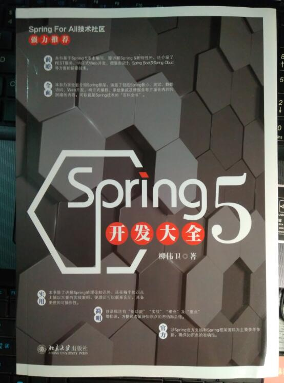

# Spring 5 Samples（Spring 5 案例大全）/《Spring 5 开发大全》示例源码

## 内容简介

自 Spring 诞生以来，以 Spring 技术栈为核心的企业级应用开发方式深入人心，已经成为 Java EE 开发的最佳实践。随着 Spring 5 版本的发布，Spring 自身也发生了巨大的变革。本书力求全面介绍 Spring 框架，涵盖了 Spring 核心、测试、数据访问、Web 开发、响应式编程、系统集成及微服务等方面在内的共26 章的内容，可以说是 Spring 技术的“百科全书”。

同时，本书基于 Spring 5 版本来编写，除了涉及 Spring 5 版本的新特性外，还介绍了 REST 服务、响应式 Web 开发、微服务设计、Spring Boot、Spring Cloud 等方面的前瞻技术。而且除了讲解 Spring 的理论知识外，还在每个知识点上辅以大量的代码案例，使理论可以联系实际，具备更强的可操作性。

本书主要面向的是Java 开发者，以及对以Spring 为核心的Java EE 开发感兴趣的计算机专业的学生、软件开发人员和系统架构师。

案例涉及 Spring 5 最新的技术。

技术版本如下：

* Apache Maven 3.5.2
* Gradle 4.5
* Spring 5.1.1.RELEASE
* Servlet 4.0.0
* JUnit 4.12
* Lo4j 2.6.2
* DBCP 2.5.0
* H2 1.4.196
* Eclipse Jetty 9.4.11.v20180605
* Jackson JSON 2.9.6
* Apache HttpClient 4.5.5
* SockJS-client 1.1.4
* STOMP Over WebSocket 2.3.3
* Reactive Streams Netty Driver 0.7.6.RELEASE
* JMS API 2.0.1
* ActiveMQ 5.15.3
* JavaMail 1.6.1
* Logback Classic Module 1.2.3
* Quartz Scheduler 2.3.0
* Spring Boot 2.0.1.RELEASE
* Spring Cloud Finchley.M9

## 写作背景

Spring 自诞生以来，一直被广大开发者作为 Java 企业级应用开发的首选。无论是早年流行的 SSH 框架（Spring、Struts、Hibernate），还是近些年盛行的 SSM 组合（Spring、Spring MVC、MyBatis），
唯一不变的就是 Spring。伴随互联网十几年的风云变迁，Spring 也不断地进行着技术革命，向着云计算、平台化方向发展。

Spring 至今仍然奉行着最初的宗旨——简化企业级应用的开发。特别是 Spring Boot、Spring Cloud 等项目的诞生，进一步简化了基于 Spring 的企业级、分布式系统的应用开发方式。为此，笔者在2014
年以开源方式翻译了[《Spring Framework 4.x 参考文档》](https://github.com/waylau/spring-framework-4-reference)，备受广大开发者关注。在2017 年，笔者编写了一系列关于 Spring 开发实战的书籍及培训视频教程，包括《Spring Boot 企业级应用开发实战》和《Spring
Cloud 微服务架构开发实战》等（见<https://waylau.com/books/>） ，致力于让广大读者能够真正领略 Spring 所带来的力量和乐趣。

目前，Spring 5 已经发布，并带来了大量的新特性。鉴于市面上关于 Spring 5 的介绍资料比较匮乏，故笔者撰写本书以补空白，助力国内开发者能够享受到新技术所带来的便利。

## 本书特色

本书具有以下特色。

* **（1）全面**：本书全面介绍 Spring 框架，涵盖了 Spring 核心、测试、数据访问、系统集成、Web 开发、响应式编程及微服务等方面在内的共26 章的内容，可以说是 Spring 技术的“百科全书”。
* **（2）前瞻**：本书基于 Spring 5 版本来编写，除了涉及 Spring 5 版本的新特性外，还介绍了 REST 服务、响应式 Web 开发、微服务设计、Spring Boot 及Spring Cloud 等方面的前瞻技术。
* **（3）实用**：本书除了讲解 Spring 的理论知识外，还在每个知识点上辅以大量的实战案例，使理论可以联系实际，具备更强的可操作性。
* **（4）简明**：目录标注有“新功能”“难点”及“重点”等标识，方便读者做好知识点的归纳和总结。
* **（5）权威**：以 Spring 官方文档和 Spring 框架源码为主要参考依据，确保知识点的权威性。

## Code 源码

所有示例源码，移步至<https://github.com/waylau/spring-5-book/>  `samples` 目录下
 
内容如下：

* s5-ch01-hello-world：快速开启第一个 Spring 应用
* s5-ch02-dependency-injection：依赖注入的例子
* s5-ch02-custom-scope：自定义scope的例子
* s5-ch02-aop-aspect：使用 @AspectJ 的例子
* s5-ch02-aop-aspect-xml：基于 XML 的 AOP 的例子
* s5-ch02-expression-language：使用 SpEL 的例子
* s5-ch05-mvc-test：服务端测试的例子
* s5-ch05-client-side-rest-test：客户端 REST 测试的例子
* s5-ch06-declarative-transaction：声明式事务管理的例子
* s5-ch08-jdbc-template：使用 JdbcTemplate 的例子
* s5-ch08-jdbc-object-mapping：JDBC 转为对象模型的例子
* s5-ch08-embedded-database：使用内存数据库进行测试的例子
* s5-ch10-jaxb-oxm：使用 JAXB 解析 XML 的例子
* s5-ch11-mvc-rest：基于 Spring Web MVC 的 REST 接口
* s5-ch12-rest-template：基于 RestTemplate 的天气预报服务
* s5-ch13-websocket-stomp：基于 STOMP 的聊天室
* s5-ch15-webclient-file：基于 WebClient 的文件上传、下载
* s5-ch19-jms-msg：基于 JMS 的消息发送、接收
* s5-ch22-java-mail：实现 Email 服务器
* s5-ch23-quartz-scheduler：基于 Quartz Schedule 天气预报系统
* s5-ch24-java-cache：基于缓存的天气预报系统
* s5-ch25-initializr-start：开启第一个 Spring Boot 项目
* s5-ch26-eureka-server、s5-ch26-eureka-client：实现微服务的注册与发现

## 配套书籍《Spring 5 开发大全》

与该源码配套的书籍《Spring 5 开发大全》已经出版，内容详见全书[目录](SUMMARY.md)。

本书如有勘误，会在<https://github.com/waylau/spring-5-book/issues>上进行发布。由于笔者能力有限，时间仓促，难免错漏，欢迎读者批评指正。

您也可以上[豆瓣](https://book.douban.com/subject/30370024/)给老卫打Call。

## 如何获取本书

实体店及各大网店有售。据我所知有如下网站供应：

* [京东](https://search.jd.com/Search?keyword=%E6%9F%B3%E4%BC%9F%E5%8D%AB%20Spring%205%20%E5%BC%80%E5%8F%91%E5%A4%A7%E5%85%A8&enc=utf-8&wq=%E6%9F%B3%E4%BC%9F%E5%8D%AB%20Spring%205%20%E5%BC%80%E5%8F%91%E5%A4%A7%E5%85%A8&pvid=23b0c41b891e439aaf944e7d08dedfdd)
* [1号店](http://search.yhd.com/c0-0/k%25E6%259F%25B3%25E4%25BC%259F%25E5%258D%25AB%2520Spring%25205%2520%25E5%25BC%2580%25E5%258F%2591%25E5%25A4%25A7%25E5%2585%25A8/)
* [淘宝](https://s.taobao.com/search?q=%E6%9F%B3%E4%BC%9F%E5%8D%AB+Spring+5+%E5%BC%80%E5%8F%91%E5%A4%A7%E5%85%A8&imgfile=&js=1&stats_click=search_radio_all%3A1&initiative_id=staobaoz_20181104&ie=utf8)
* [当当](http://search.dangdang.com/?key=%C1%F8%CE%B0%CE%C0%20Spring%205%20%BF%AA%B7%A2%B4%F3%C8%AB&act=input)
* [亚马逊](https://www.amazon.cn/s/ref=nb_sb_noss?__mk_zh_CN=%E4%BA%9A%E9%A9%AC%E9%80%8A%E7%BD%91%E7%AB%99&url=search-alias%3Daps&field-keywords=%E6%9F%B3%E4%BC%9F%E5%8D%AB+Spring+5+%E5%BC%80%E5%8F%91%E5%A4%A7%E5%85%A8&rh=i%3Aaps%2Ck%3A%E6%9F%B3%E4%BC%9F%E5%8D%AB+Spring+5+%E5%BC%80%E5%8F%91%E5%A4%A7%E5%85%A8)

想低于市价得到本书？来[二手书集市](https://github.com/waylau/second-hand-books)试试看。

也可以直接关注我博客（<https://waylau.com/>）或者我的开源书（<https://waylau.com/books/>）了解更多免费咨询。

## 联系作者

您也可以直接联系我：

* 博客：https://waylau.com
* 邮箱：[waylau521(at)gmail.com](mailto:waylau521@gmail.com)
* 微博：http://weibo.com/waylau521
* 开源：https://github.com/waylau

## 其他书籍

若您对本书不感冒，笔者还写了其他方面的超过一打的书籍（可见<https://waylau.com/books/>），多是开源电子书。

本人也维护了一个[books-collection](https://github.com/waylau/books-collection)项目，里面提供了优质的专门给程序员的开源、免费图书集合。

## 开源捐赠

捐赠所得所有款项将用于开源事业！见[捐赠列表](https://waylau.com/donate)。
